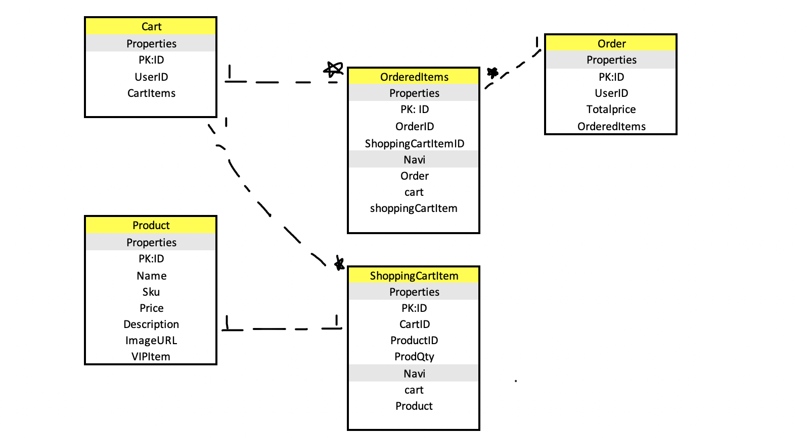

#Project Name: Mystical pets

Deployed site: https://xljlecommercedotnet401.azurewebsites.net/
<!-- might have changed to: https://xljlecommercedotnetv2.azurewebsites.net/ -->

##Description

This is an Ecommerce market project. We mainly sell mystical creatures (alive), such as unicorns ,dragons. 
Users can view all the products and view detail of each product, if they like the product, they can order it only after they login.

##Developers for the project

Julie Ly-- Developer 1;
Xia  Liu -- Developer 2;

##Technology 

We use Microsoft Azure Devops to create our repo and create milstione and sprints and tasks.
We use C# language.
We use Asp.Net Core platform.
We use SQL server database.

## Claims

This project our claims contain:

-User's FullName(FirstName+LastName)

-User's Birthdate

-User's Email

-User's registerDate

The reason we chose above information as claims is we capture the fullname because we want to welcome that user by username on the page after user Login,

we capture the registerDate because we have Prime Members based on the time since they register the account.

##Policy

Our policy is We have Prime members who have been registered over a certain time(we are using "one-day" for now, intend will be a year to be a Prime Member)

##OAUTH Providers

We have two third-party providers for external login: Microsoft an Facebook

##Structure/Database schema

The following image is our database schema:

Product:  product has Name, Sku, Price,Description, ImageUrl and boolean type to check if this is a VIP product

ShoppingCartItem: it has foreign ids: cartID, ProductID , each cart will have many ShoppingCartItems, and we have ProdQty(product quantity) for shoppingCartItem model.

Cart(basket): it has foreign id:UserID, each user will have their own cart, and one cart holds multiple shoppingCartitems, one cart also has multiple Ordereditems(when user checkout, the shoppingcartItem will turn to the ordereditems)

OrderedItems: it has two foreign keys:OrderID and shoppingCartitemID, it can navigate to Ordertable and cart table and ShoppingcartItem table, one order can have many orderedItems

Order:it has userID as a foreign key and it has totalprice and Ordereditems as properties, one order can have many oerderedItems

When user register successfully with our website, user will be given a cart, and when they put items in the shopping cart, cart will have many ShoppingCartItems, and user can view product details because shoppingCartItem can navigate to the product database table and grab that single product information,

after adding items to cart, when user checkout, ordereditems will be created  based on the cartID associated with UserID and then move all the items from shoppingCartItem table to OrderedItems table,then create the final order.

<!--
Notes for citing:
Images from Pixabay
Used this for resizing images: https://www.photoresizer.com/

needed to make a change for commit since it doesn't recog changes in user secret

-->

